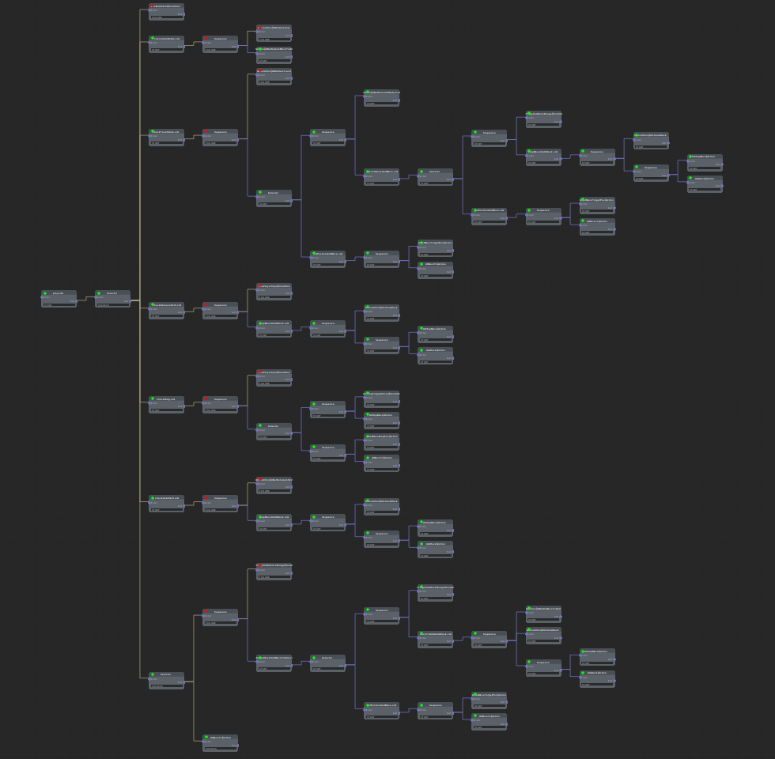

# ZTools
EditorDebugToolSet
调试用的工具集合  
## 显示Gizmos
代码调用  
DebugGizmo.Instance.Draw()  
TIPS: 目前支持AABB显示，OBB显示，Quaternion显示，点线等等，可自行拓展  
效果  
  
## 显示调试行为树  
TIPS:  
代码使用了第三方插件xNode，详见内部的Readme.md。  
如果是第三方的插件导出的行为树，unity内部没有办法看的很清楚运行逻辑,这个代码很合适你。

代码调用  
```csharp
        //创建行为树
        DebugXNode.Instance.CreateGraph(1);
        int gap = 300;
        int node1 = DebugXNode.Instance.AddNode(1,"1");
        int node2 = DebugXNode.Instance.AddNode(1,"2");
        int node3 = DebugXNode.Instance.AddNode(1,"3");
        int node31 = DebugXNode.Instance.AddNode(1,"3-1");
        int node32 = DebugXNode.Instance.AddNode(1,"3-2" );

        //是指位置
        DebugXNode.Instance.SetNodePosition(1,node1,0,0);
        DebugXNode.Instance.SetNodePosition(1,node2, gap, 0);
        DebugXNode.Instance.SetNodePosition(1,node3, gap * 2, 0);
        DebugXNode.Instance.SetNodePosition(1,node31, gap * 3, 0);
        DebugXNode.Instance.SetNodePosition(1,node32, gap * 3, gap );
        
        //连接节点
        DebugXNode.Instance.LinkNode(1, node1, node2);
        DebugXNode.Instance.LinkNode(1, node2, node3);
        DebugXNode.Instance.LinkNode(1, node3, node31);
        DebugXNode.Instance.LinkNode(1, node3, node32);
        
        //代码运行到此处，给予编辑器信号
        DebugXNode.Instance.StepNode(1, node32, 2);
        DebugXNode.Instance.StepNode(1, node3, 2);
```

```lua
    --
    --如何排版树，
    --坐标x，自行计算，可以在构造树的代码处记录树的层级
    --坐标y, 参考以下代码
    --BTNode 是所有行为树节点的基类
    --
    function BTNode:CalculateHeight()
        self.sum = 0
        
        for i = #self._childNodeList, 1, -1 do
            local node = self._childNodeList[i]
            self.sum = self.sum + node:CalculateHeight()
        end
        
        if #self._childNodeList == 0 then
            BTNode.LEAFCOUNT = BTNode.LEAFCOUNT + 1
            self.height = - 120 * BTNode.LEAFCOUNT
            return self.height 
        else
            self.height =  self.sum / #self._childNodeList
        end
        
    
        return self.height
    end
```  
效果预览  
  